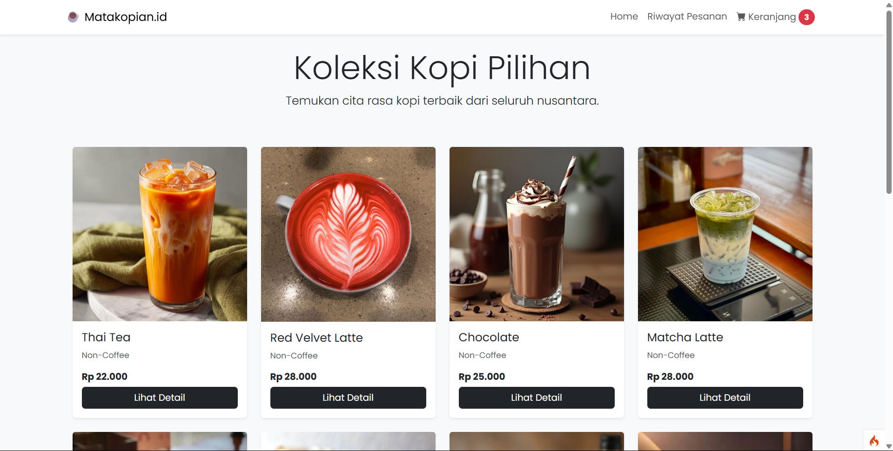
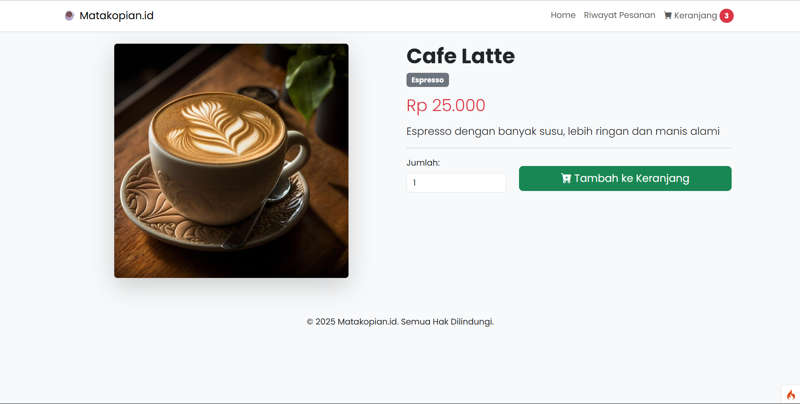
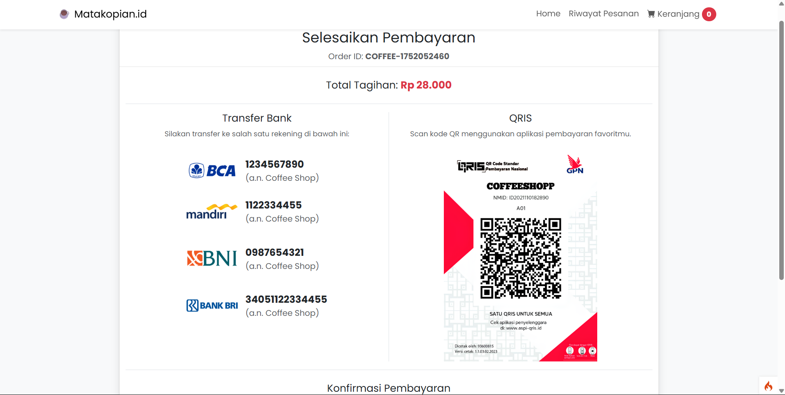
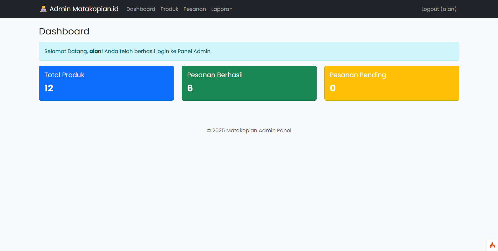
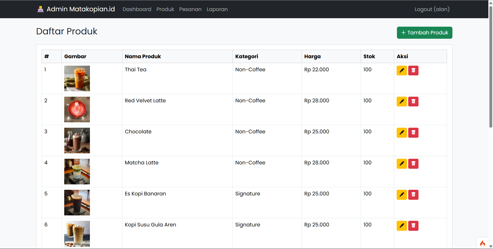
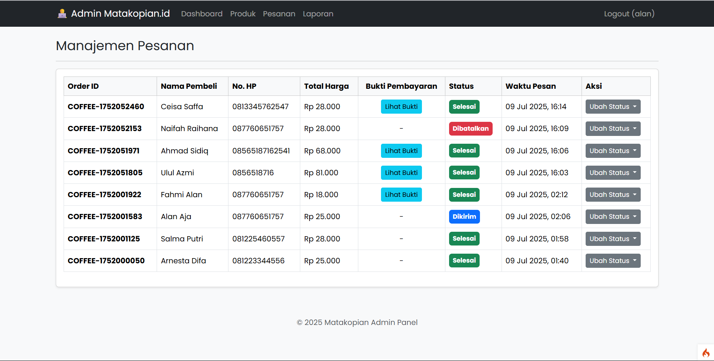
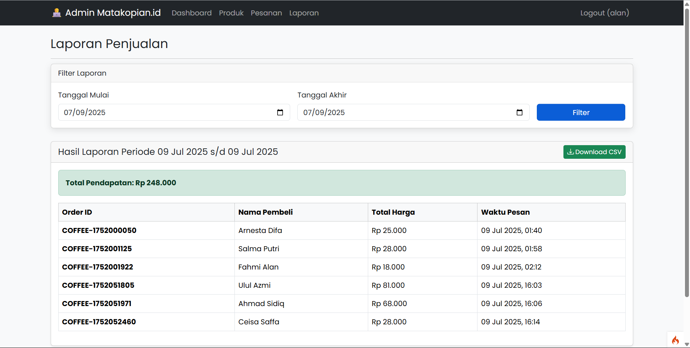

# ☕ Aplikasi Web Coffee Shop v1.0

Ini adalah aplikasi web e-commerce sederhana untuk sebuah **Coffee Shop** yang dibangun menggunakan framework **CodeIgniter 4**. Aplikasi ini memiliki fitur katalog produk, keranjang belanja, serta sistem pembayaran manual dengan upload bukti transfer.

---

## 🚀 Fitur Utama

### 👨‍💻 Admin Panel
- 🔐 **Autentikasi**: Login dan registrasi aman untuk admin.
- 📊 **Dashboard**: Ringkasan data produk dan pesanan.
- 📦 **CRUD Produk**: Tambah, lihat, edit, dan hapus produk kopi (nama, harga, deskripsi, stok, gambar).
- 📑 **Manajemen Pesanan**: Pantau pesanan masuk secara real-time.
- 🧾 **Verifikasi Pembayaran**: Lihat bukti transfer dari pelanggan.
- 🔄 **Update Status Pesanan**: Ubah status secara manual *(Menunggu Konfirmasi, Diproses, Dikirim, Selesai, Dibatalkan)*.

### 🛍️ Halaman User (Pembeli)
- 🛒 **Katalog Produk**: Tampilkan seluruh produk kopi.
- 🔍 **Detail Produk**: Lihat informasi detail tiap produk.
- 🧺 **Keranjang Belanja**: Tambah/hapus produk, dan kosongkan keranjang.
- 📝 **Form Checkout**: Input nama, nomor HP, dan alamat.
- 💳 **Pembayaran Manual**: Tampilkan rekening, QRIS, dan form upload bukti.
- 📦 **Riwayat Pesanan**: Lacak status pesanan berdasarkan nomor HP.

---

## 🛠️ Teknologi yang Digunakan
- **Framework**: CodeIgniter 4
- **Bahasa**: PHP 8+
- **Database**: MySQL / MariaDB
- **Frontend**: Bootstrap 5
- **Server Lokal**: Laragon (direkomendasikan) atau XAMPP
- **Manajemen Dependensi**: Composer

---

## 🗂️ Struktur Folder

```
/coffeeshopp/
│
├── app/
│   ├── Controllers/
│   │   ├── Admin/
│   │   ├── Home.php
│   │   ├── Cart.php
│   │   ├── Checkout.php
│   │   └── Pembayaran.php
│   ├── Models/
│   └── Views/
│       ├── layout/
│       ├── admin/
│       └── user/
│
├── public/
│   ├── assets/
│   │   ├── css/
│   │   ├── js/
│   │   ├── images/
│   │   └── bukti_pembayaran/
│   └── .htaccess
│
├── writable/
├── .env
├── composer.json
└── spark
```

---

## ⚙️ Cara Instalasi & Setup Lokal

### 1. Clone Repository
```bash
git clone https://github.com/FAHMIALAN/COFFEESHOOPP.git
cd COFFEESHOOPP
```

### 2. Install Dependensi
> Pastikan Composer sudah terinstall di sistem Anda.

```bash
composer install
```

### 3. Konfigurasi Environment
- Salin file `env` ke `.env`
- Sesuaikan pengaturan:
  - `database.default.*`
  - `app.baseURL` (contoh: `http://localhost:8080/`)

### 4. Setup Database
- Buat database MySQL: `db_coffeeshop`
- Jalankan migrasi:
  ```bash
  php spark migrate
  ```
- Jalankan seeder (akun admin default):
  ```bash
  php spark db:seed AdminSeeder
  ```

### 5. Siapkan Aset Gambar
- Buat folder `bukti_pembayaran` di `public/assets/`
- Letakkan gambar QRIS dan beri nama `qris_placeholder.png` di `public/assets/images/`

### 6. Jalankan Server
```bash
php spark serve
```
Akses aplikasi di `http://localhost:8080`

> Jika menggunakan **Laragon**, cukup start dan buka `http://coffeeshopp.test`

---

## 🧪 Cara Penggunaan

### 🔑 Sebagai Admin
1. Kunjungi `/admin/login`
2. Login:
   - **Username**: `admin`
   - **Password**: `password123`
3. Tambahkan produk melalui menu **Produk**

### 🛍️ Sebagai Pembeli
1. Akses halaman utama
2. Pilih produk dan masukkan ke keranjang
3. Checkout dan upload bukti pembayaran

### 📦 Admin Cek Pesanan
1. Kembali ke admin panel
2. Lihat halaman **Manajemen Pesanan**
3. Verifikasi bukti pembayaran dan ubah status pesanan

---

## 📄 Lisensi
Proyek ini bersifat open-source dan bebas digunakan untuk keperluan edukasi dan pengembangan.

---

## 🙋‍♂️ Kontribusi
Ingin bantu mengembangkan? Silakan fork repo ini dan kirimkan pull request!

---

Terima kasih sudah menggunakan **Aplikasi Coffee Shop v1.0** ☕

---
## Tampilan User

  
  
 

---
## Tampilan Admin
  
  

---